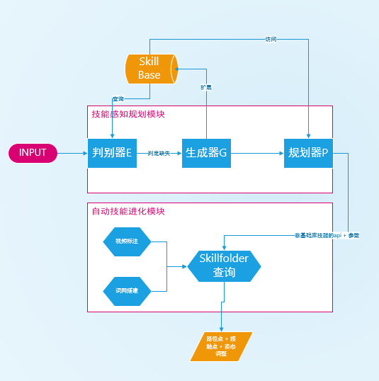

# 在Uni-skill中如何理解skillfolder中的参考以及如何进化技能？

## 展示执行流

在技能感知规划模块中，判别器E用来感知技能缺失，生成器G用来生成技能描述(Api + 文本描述)，规划器P用来规划技能执行。而在执行过程中，不涉及自动进化模块的Skillfolder搭建工作，只涉及技能参考查询。执行流如下:

## 阐述如何理解参考

规划器负责编排技能(api)的执行，当系统在执行基本技能库中没有的技能时，需要将对应的技能api 和 参数传入skillfolder。skillfolder按照api与节点进行比对，拿到最合适的参考。参考包括实例视频，路径轨迹，路径以及接触点的约束文本。

当拿到参考信息后，提取其中信息，包括 接触点 + 轨径 + 接触点与路径约束（文本）。 随后将轨迹点转化为目标场景的2d轨迹,再利用深度图进行3d转换。如此得到机器人运动的行为轨迹。但是还需要控制机器人本身的动作，因此还需要提取示例中姿态信息以用于机器人控制。

## 技能进化
在我的理解之下，论文中所提到的技能进化指的是对指令能力的泛化。具体来说，当机器人做一些任务时，它现有的技能库无法满足任务需求，需要新的示例进行参考实现能力的泛化。

在这篇论文中，技能进化依靠技能感知规划模块的生成器P完成能力的扩展。具体为生成Api（函数名）以及技能描述组合为一个新的skill，并将新生成的skill加入skill库。由规划器生成整个程序，执行程序时以懒加载的方式去访问skillfolder。

